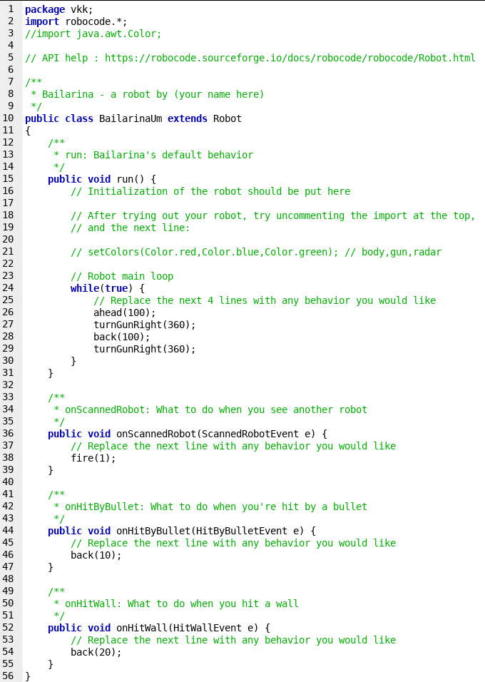

# Bailarina

[fsmBailarinaUm]:  fsm-bailarinaum.png

## Introdução
Começaremos com um robô simples, ao qual chamaremos de BailarinaUm.
A princípio, criaremos um robô da classe "Robot" que simplesmente fica escaneando seus arredores e atira quando encontra um inimigo. Robôs dessa classe possuem uma notável desvantagem: Eles fazem apenas uma coisa por vez, seja mover-se, atirar, girar o chassis, girar a arma ou girar o radar. Considerando que o radar está em cima da arma, e a arma em cima do chassis, um movimento de giro do chassis normalmente<sup>[0]</sup> afeta/gira o veículo todo (incluindo arma e radar); e um giro da arma normalmente<sup>[0]</sup> afeta/gira o radar (mas não afeta o veículo, como seria de se esperar).
Por enquanto, nosso robô não irá se movimentar. Tudo o que este robô estará fazendo é girar incansavelmente a arma (e consequentemente o radar) a procura de adversários (chamemos este estado de "Girar"). Quando encontrar algum, ele irá parar de girar e começará a simplesmente atirar (chamemos o estado de "Atirar"). Ele irá parar de atirar quando errar algum disparo, e então voltará ao estado "Girar":


Vamos começar criando nosso robô usando como base o modelo que o Robocode nos fornece no editor (Sinta-se livre para usar a IDE/Editor de texto que preferir, bem como começar o código-fonte do zero):




As linhas 24 a 30 contém o código do robô de sugestão, mas nós iremos criar nosso próprio loop. Por questão de conveniência, iremos seguir a sugestão dos comentários em inglês e iremos pintar nosso robô através das linhas 3 e 21. Além disso, como nosso robô não irá se movimentar, não precisaremos das linhas 52 a 55, que correspondem a detecção de colisão contra as bordas do jogo; nem das linhas 44 a 47, que correspondem a resposta do robô quando ele é atingido (o nosso robô é ingênuo):

```java
package vk;
import robocode.*;
import java.awt.Color;

// API help : https://robocode.sourceforge.io/docs/robocode/robocode/Robot.html

/**
 * Bailarina - a robot by Victor Koehler
 */
public class BailarinaUm extends Robot
{
	/**
	 * run: Comportamento de BailarinaUm
	 */
	public void run() {
		// Initialization of the robot should be put here

		setColors(Color.red,Color.red,Color.blue); // Definimos as cores (chassis, arma e radar)
		
		// Nosso próprio loop
	}

	/**
	 * Quando nosso radar escaneia algum robô inimigo
	 */
	public void onScannedRobot(ScannedRobotEvent e) {
		// Replace the next line with any behavior you would like
		fire(1);
	}
}
```


Vamos fazer nosso próprio loop? Lembrando que esse robô é uma máquina de estados, logo vamos usar uma variável para armazenar nossos dois estados: `atirando` é do tipo boolean e possui valor "true" quando estamos com o escaneamento parado (isto é, estado "Atirar"); "false" caso o estado seja "Girar". Considerando que nosso robô deve começar escaneando nossos inimigos, então o valor inicial dessa variável é "false". Em seguida, vamos criar um método que conterá nosso loop:

```java
/**
 * Nosso robô está sempre entre dois estados definidos por "atirando".
 * Esse método cuida do estado "Girar"
 */
private void scanLoop() {
	while(true) {
		if (!atirando) {
			// Nosso estado agora é "Girar"
			turnGunRight(360); // Então vamos girar a arma.
		}
		
		// Se não estamos no estado "Girar", então apenas esperamos
	}
}
```

_O leitor é convidado a experimentar diferentes valores para turnGunRight._


Durante estas continuas rotações desse estado, o radar também estará girando e escaneando os arredores. Quando o mesmo detectar um inimigo, o método `onScannedRobot` será invocado, permitindo-nos alterar o estado de nosso robô para "Atirar" e entrarmos no seu respectivo loop:

```java
/**
 * Quando nosso radar escaneia algum robô inimigo.
 */
public void onScannedRobot(ScannedRobotEvent e) {
	// Detectamos um inimigo!
	// Nesse momento, alteramos o estado do robô para "Atirar"
	atirando = true;

	// Entramos no estado "Atirar".
	while(atirando) {
		fire(2); // Então atiramos.
	}
}
```


Note que o loop de `scanLoop` nunca é interrompido, mas quando o valor de `atirando` é alterado para "true" aqui, então aquele loop passa a não fazer nada. No entanto, este loop de `onScannedRobot` irá continuamente disparar em linha reta (agora a arma já não mais está girando).

Finalmente, notemos que precisamos voltar para o estado "Girar" eventualmente; seja porque derrotamos o adversário, ou porque ele se movimentou. Por enquanto, que tal tentarmos o método `onBulletMissed`?

```java
/**
* Em algum momento, nosso tiro atingiu o muro, o que signifca que erramos.
* Ou seja, nosso inimigo não está mais na linha de tiro.
*/
public void onBulletMissed(BulletMissedEvent event) {
	// Erramos o tiro? Volta para o estado "Girar" para encontrar o adversário!
	atirando = false;
}
```

Quando um tiro atingir o muro, voltamos para o estado "Girar". Simples.

Ao testarmos, podemos perceber que as condições dos loops não são suficientes: Quando um inimigo é escaneado, a arma ainda gira por algum tempo até parar completamente. Para contornar isto, vamos inserir em `onScannedRobot` uma forma de corrigir a direção da arma:


```java
/**
 * Quando nosso radar escaneia algum robô inimigo.
 */
public void onScannedRobot(ScannedRobotEvent e) {
	// Detectamos um inimigo!
	// Nesse momento, alteramos o estado do robô para "Atirar"
	atirando = true;

	// Usamos algumas funções para reajustar a mira
	double turnGunAmt = Utils.normalRelativeAngleDegrees(e.getBearing() + getHeading() - getGunHeading());
	turnGunRight(turnGunAmt);

	// Entramos no estado "Atirar".
	while(atirando) {
		fire(2); // Então atiramos.
	}
}
```


<br /> <br />

---

## Bailarina II

Executar o BailarinaUm mesmo contra um simples adversário como sample.Fire pode ser frustrante: O robô tem a maior parte de sua energia perdida através de tiros desperdiçados! Vamos elaborar uma simples maneira de evitar isso?


Aqui vamos abstrair a existência do terceiro estado "Escanear" mostrado na figura. Isto é, não iremos implementar uma variável e controles explicitos para esse novo estado, ele serve apenas para fins ilustrativos.

Resumidamente, vamos substituir o loop de onScannedRobot por uma instrução para atirar, uma instrução para escanear e outra para definir a variável de estado para "false":

```java
/**
	* Quando nosso radar escaneia algum robô inimigo.
	*/
public void onScannedRobot(ScannedRobotEvent e) {
	// Detectamos um inimigo!
	// Nesse momento, alteramos o estado do robô para "Atirar"
	atirando = true;

	// Usamos algumas funções para reajustar a mira
	double turnGunAmt = Utils.normalRelativeAngleDegrees(e.getBearing() + getHeading() - getGunHeading());
	turnGunRight(turnGunAmt);

	fire(4); // Simplesmente atiramos
	scan(); // Solicitamos um novo escaneamento
	
	atirando = false; // Se chegamos aqui, então voltamos ao estado "Girar"
}
```

O que acontece é que o método `scan()` normalmente é implicitamente chamado ao efetuar-se ações comuns, como movimentos e rotações; Aqui estamos forçando a chamada do método, que entrará recursivamente enquanto houver algum inimigo na linha de frente. Quando, enfim, o adversário mover-se ou morrer, então o método sairá e a instrução para redefinir o valor da variável de estado será executada.


<br /> <br />

---

## Bailarina III

Mover-se é uma manobra indiscutivelmente necessária. Nessa versão, iremos implementar a habilidade de fugir quando recebido dano por tiros.

Por hora, optamos por criar uma nova variável booleana: `fugindo` será igual a "true" quando o robô estiver fugindo, "false" caso contrário. Simples.


Obviamente precisamos fazer algumas alterações no nosso código. No nosso caso, quando o robô for atingido, entrará imediamente no modo fugindo, tal que irá interromper o que quer que esteja fazendo.

```java
private boolean atirando; // Controla os estados atirando/girando do robô
private boolean fugindo; // Se o robô está fugindo

/**
 * run: Comportamento de BailarinaTres
 */
public void run() {
	setColors(Color.red,Color.red,Color.yellow); // Definimos as cores (chassis, arma e radar)

	atirando = false;
	fugindo = false;
	scanLoop(); // Loop principal
}

/**
 * Nosso robô está sempre entre três estados definidos por "atirando" e "fugindo".
 * Esse método cuida do estado "Girar"
 */
private void scanLoop() {
	while(true) {
		if (!atirando && !fugindo) {
			// Nosso estado agora é "Girar"
			turnGunRight(360); // Então vamos girar a arma.
		}
		
		// Se não estamos no estado "Girar", então apenas esperamos
	}
}

/**
 * Quando nosso radar escaneia algum robô inimigo.
 */
public void onScannedRobot(ScannedRobotEvent e) {
	// Se estamos fugindo, vamos ignorar o inimigo.
	if (fugindo) {
		return;
	}

	// Detectamos um inimigo!
	// Nesse momento, alteramos o estado do robô para "Atirar"
	atirando = true;

	// Usamos algumas funções para reajustar a mira
	double turnGunAmt = Utils.normalRelativeAngleDegrees(e.getBearing() + getHeading() - getGunHeading());
	turnGunRight(turnGunAmt);

	fire(4); // Simplesmente atiramos
	scan(); // Solicitamos um novo escaneamento
	
	atirando = false; // Se chegamos aqui, então voltamos ao estado "Girar"
}
```

Deixaremos a mágica da detecção dos disparos recebidos a cargo de `onHitByBullet`. Nessa implementação em particular, geramos aleatoriamente a distância e o ângulo que iremos percorrer na fuga (com base em alguns parâmetros limites). Logo após os movimentos, redefinimos o estado do sistema ao passo que forçamos um escaneamento de inimigos (estado "Escanear" da figura).
	
```java
/**
 * Quando somos atingidos por um disparo
 */
public void onHitByBullet(HitByBulletEvent event) {	
	// Estamos oficialmente fugindo!
	fugindo = true;
	
	// Tomemos uma direção e distância aleatórias!
	Random rand = Utils.getRandom();
	double distance = rand.nextDouble() * 250 + 175;
	double angle = rand.nextDouble() * 115 + 40;
	
	if (rand.nextBoolean()) {
		angle *= -1.0;
	}

	turnRight(angle);
	ahead(distance);
	turnGunLeft(angle);
	
	// Depois de fugir, voltamos ao estado normal
	fugindo = false;
	atirando = false;
	scan();
}
```

Finalmente, é aconselhável que todo robô que execute movimentos (e eles certamente executam) possua alguma implementação para colisões contra os limites do jogo (ou muro). O trecho usado em BailarinaTres é simples: Ao encostar no muro, pare tudo o que está fazendo, gire a frente na direção contrário e ande uma determinada distância. Após isso, volte ao estado "Escanear" da figura.

```java
/**
 * Agora que nosso robô pode se mover, precisamos de uma detecção contra o muro.
 */
public void onHitWall(HitWallEvent event) {
	stop(); // Para tudo o que está fazendo
	turnRight(-event.getBearing()); // Gira para o lado oposto
	ahead(300); // Se afasta do muro

	// Voltamos ao estado normal
	fugindo = false;
	atirando = false;
	scan();
}
```

No caso do código-fonte disponível no repositório, ainda há uma pequena e trivial modificação adicional: Um contador chamado `contaPaciencia`, sua função é contar quantos disparos consecutivos o robô recebeu e evitar que ele fique fugindo o tempo todo. Nessa implementação em particular, o robô contará até três [disparos] quando finalmente vai fugir e recomeçar as contas.


<br /> <br />

---

## Notas de Rodapé
0. É possível mudar esses comportamentos através dos métodos [setAdjustGunForRobotTurn](https://robocode.sourceforge.io/docs/robocode/robocode/Robot.html#setAdjustGunForRobotTurn-boolean-), [setAdjustRadarForGunTurn](https://robocode.sourceforge.io/docs/robocode/robocode/Robot.html#setAdjustRadarForGunTurn-boolean-), [setAdjustRadarForRobotTurn](https://robocode.sourceforge.io/docs/robocode/robocode/Robot.html#setAdjustRadarForRobotTurn-boolean-).