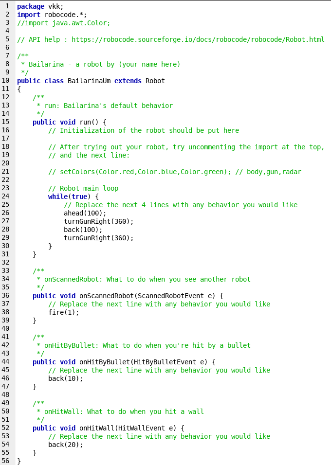

# Fujão

## Introdução
Um robô cujo único propósito é perambular aleatoriamente pelo cenário. No entanto, será útil para conhecer as limitações do jogo.

## Fujao I
Podemos começar com base no código fornecido ao criar um novo arquivo no Source Editor do Robocode:



Vamos remover o loop principal e inserir o nosso, bem como dar uma aparência própria ao tanque:

```java
/**
 * run: Comportamento padrão de FujaoUm
 */
public void run() {
    setColors(Color.yellow,Color.yellow,Color.blue); // Definimos as cores (chassis, arma e radar)
    
    mainLoop();
}
```

O Loop principal deverá estar sempre em execução, portanto ele também será constituido por um `while (true)`:

```java
/**
 * Nosso loop principal
 */
private void mainLoop() {
    while (true) {
        // Algumas variáveis de movimento.
        Random rand = Utils.getRandom(); // Gerador de valores aleatórios
        double height = getBattleFieldHeight(); // Largura do campo de batalha
        double width = getBattleFieldWidth(); // Comprimento do campo de batalha
        double distance = rand.nextDouble() * 600 + 150; // Distância a ser percorrida
        double angle = rand.nextDouble() * 60 + 30; // Ângulo da rotação
        
        if (rand.nextBoolean()) {
            angle *= -1.0; // Se vamos girar para o lado contrário
        }
        if (rand.nextBoolean()) {
            distance *= -1.0; // Se vamos andar para o lado contrário
        }
        
        turnRight(angle); // Primeiro rotacionamos o tanque
        scan(); // Escaneamos para verificar a ocorrência de um inimigo na direção
        ahead(distance); // Depois andamos para frente (para trás caso distance < 0)
        turnGunLeft(15); // Uma leve rotação para forçar o escaneamento de inimigos.
    }
}
```

Cumprindo a promessa, o robô irá definir a distância a ser percorrida e a direção aleatoriamente, com certos limites: A distância D que o robô percorrerá está entre 150 <= D <= 750 (mínimo de 150 e máximo de 750) pixels, a unidade de distância, para trás ou para frente; o ângulo A em relação a direção original será de 30º <= A <= 90º, horário ou anti-horário.

Após efetuarmos os movimentos, certificamos-nos de escanear os arredores para efetuarmos disparos convenientes. Por hora, a função de escaneamento `onScannedRobot` irá simplesmente disparar uma vez e novamente irá invocar a chamada para escaneamento. Isso significa que enquanto o adversário estiver parado na frente do radar, este robô irá ficar preso em loop recursivo do próprio `onScannedRobot`, sempre atirando e verificando, atirando e verificando...

```java
/**
 * onScannedRobot: Um robô foi detectado pelo radar
 */
public void onScannedRobot(ScannedRobotEvent e) {
    // Vamos simplesmente efetuar um disparo em sua direção
    fire(4);
    scan(); // Escaneamos para verificar a ocorrência de um inimigo na direção
}
```

Por fim, vamos implementar um simples método para o robô recuar (andar para trás) quando for atingido por um disparo, bem como um método para detecção contra colisão contra as bordas do mapa (muros), essencial para qualquer robô que se movimenta:

```java
/**
 * onHitByBullet: Tanque atingido por um disparo!
 */
public void onHitByBullet(HitByBulletEvent e) {
    // Recuar!
    back(400);
}

/**
 * onHitWall: O veículo atingiu um muro enquanto movimentava-se.
 */
public void onHitWall(HitWallEvent e) {
    turnRight(-e.getBearing()); // Gira para o lado oposto
    ahead(300); // Se afasta do muro
}
```


<br /> <br />

---

## Fujao II
A segunda versão do Fujao é apenas um aprimoramento no método `onHitByBullet`:

```java
/**
 * onHitByBullet: Tanque atingido por um disparo!
 */
public void onHitByBullet(HitByBulletEvent e) {
    // Paramos tudo o que estamos fazendo.
    stop();
    scan(); // Escaneamos para verificar a ocorrência de um inimigo na direção

    // Giramos a arma na direção do disparo
    double turnGunAmt = Utils.normalRelativeAngleDegrees(e.getBearing() + getHeading() - getGunHeading());
    turnGunRight(turnGunAmt);

    scan(); // Escaneamos para verificar a ocorrência de um inimigo na direção
    back(400); // Recuamos
}
```

Ao invés de apenas recuar, esta versão irá procurar o adversário que efetuou o disparo, girar o canhão em sua direção, escanear (que por sua vez leva ao disparo), e então recuar.


<br /> <br />

---

## Considerações Finais

Ao experimentar estes protótipos, pode-se verificar a terrível ineficiência de fazer apenas uma coisa ao mesmo tempo<sup>[0]</sup> (é possível perceber que este robô deixa passar inumeras chances de atirar quando está se movimentando). Para contornar este problema, pode-se usar os recursos que a classe `AdvancedRobot` oferece, embora isto esteja fora do escopo deste artigo.


<br /> <br /> <br />

---

## Notas de Rodapé
0. Como visto em [Bailarina](Bailarina.md)